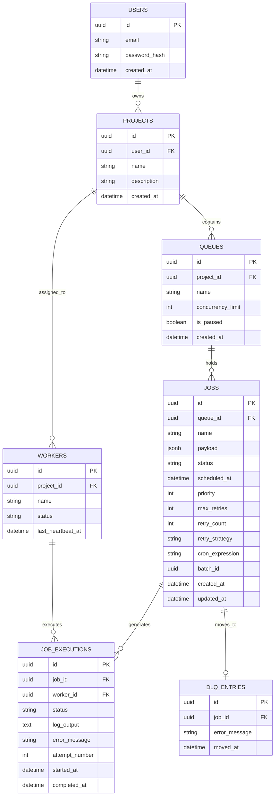

# Architecture & System Design

## System Overview

JobFlow is a distributed job scheduling platform with three main components:
1. **Frontend** — React + Vite SPA hosted on Vercel
2. **Backend** — FastAPI REST API hosted on Render
3. **Worker** — Python background process (run locally or on Render)

All components share a **PostgreSQL** database on Render (or SQLite for local development).

---

## Component Architecture

```
┌─────────────────────────────────────────────────────────────┐
│  FRONTEND (Vercel)                                           │
│  React + Vite  →  JWT Auth  →  REST API calls               │
└───────────────────────────┬─────────────────────────────────┘
                            │ HTTPS + JWT
                            ▼
┌─────────────────────────────────────────────────────────────┐
│  BACKEND API (Render)                                        │
│  FastAPI  ─  Auth  ─  Projects  ─  Queues  ─  Jobs          │
│           ─  Dashboard  ─  CORS middleware                   │
└───────────────────────────┬─────────────────────────────────┘
                            │ SQLAlchemy ORM
                            ▼
┌─────────────────────────────────────────────────────────────┐
│  DATABASE                                                    │
│  PostgreSQL (prod)  /  SQLite (dev)                          │
│  Tables: jf_users, jf_projects, jf_queues, jf_jobs,         │
│          jf_workers, jf_job_executions, jf_dlq_entries       │
└───────────────────────────▲─────────────────────────────────┘
                            │ Heartbeat + Poll + Claim
                            │
┌───────────────────────────┴─────────────────────────────────┐
│  WORKER PROCESSES (Local / Render / Docker)                  │
│  python -m worker.worker_main [--project-id PROJECT_ID]      │
│                                                              │
│  Loop every 2s:                                              │
│   1. Send heartbeat to jf_workers                            │
│   2. Check queue concurrency limits                          │
│   3. Claim job atomically (FOR UPDATE SKIP LOCKED)           │
│   4. Execute job (mock / real)                               │
│   5. Log result to jf_job_executions                         │
│   6. Retry / DLQ on failure                                  │
│   7. Schedule next run for cron jobs                         │
└─────────────────────────────────────────────────────────────┘
```

---

## Sequence: Job Lifecycle

```
Client           API           DB              Worker
  │  POST /jobs   │             │                │
  ├──────────────►│             │                │
  │               │ INSERT job  │                │
  │               ├────────────►│ status=queued  │
  │               │             │                │
  │  ◄────────────┤             │                │
  │               │             │   Heartbeat    │
  │               │             │◄───────────────┤
  │               │             │                │
  │               │             │  Poll for jobs │
  │               │             │◄───────────────┤
  │               │             │                │
  │               │             │  UPDATE status │
  │               │             │  = claimed     │
  │               │             │◄───────────────┤
  │               │             │                │
  │               │             │  Execute job   │
  │               │             │                ├──── (2s mock)
  │               │             │                │
  │               │             │  UPDATE status │
  │               │             │  = completed   │
  │               │             │◄───────────────┤
  │               │             │  INSERT execution│
  │               │             │◄───────────────┤
```

---

## Entity Relationship (ER) Diagram


